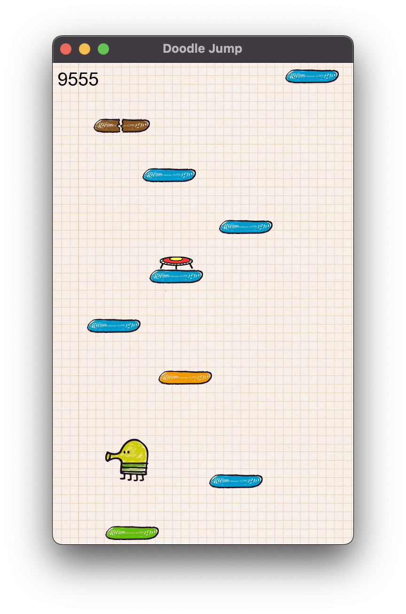

# Doodle Jump
The famous addictive game by Lima Sky rewritten in C++



# Prerequirement

You will need to install the SFML library to build the game:  
https://www.sfml-dev.org/download/sfml/2.5.1/

# Build

Enter the following commands to build the game:
```
cmake . -B build
cmake --build build
```

# Usage
```
./DoodleJump
```

# Legal

The source code in this repository is for non-commercial use only. If you use the source code you may not charge others for access to it or any derivative work thereof.

Doodle Jump® - Copyright © Lima Sky, LLC. All rights reserved.

All assets in this project are the property of Lima Sky, LLC.

Martin Olivier and any of others maintainers are in no way associated with or endorsed by Lima Sky, LLC.